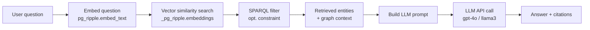

# Build a RAG Pipeline from Scratch

This recipe walks through building a complete Retrieval-Augmented Generation (RAG) pipeline using pg_ripple's hybrid SPARQL + vector search. By the end you will have a system that answers natural-language questions using your knowledge graph as the context source.

## Architecture



## Prerequisites

- pg_ripple v0.49.0 or later (NL→SPARQL), v0.28.0+ (vector embeddings)
- pgvector extension installed
- OpenAI API key (or any OpenAI-compatible endpoint)
- Python 3.11+ with `psycopg`, `openai`, `requests`

```bash
pip install psycopg openai requests
```

---

## Step 1: Enable Embeddings

```sql
-- Set embedding endpoint (OpenAI-compatible)
ALTER SYSTEM SET pg_ripple.embedding_api_url = 'https://api.openai.com/v1';
ALTER SYSTEM SET pg_ripple.embedding_api_key = 'sk-...';
ALTER SYSTEM SET pg_ripple.embedding_model = 'text-embedding-3-small';
ALTER SYSTEM SET pg_ripple.embedding_dimensions = 1536;
ALTER SYSTEM SET pg_ripple.auto_embed = on;
SELECT pg_reload_conf();
```

For local Ollama embeddings:

```sql
ALTER SYSTEM SET pg_ripple.embedding_api_url = 'http://localhost:11434/v1';
ALTER SYSTEM SET pg_ripple.embedding_model = 'nomic-embed-text';
ALTER SYSTEM SET pg_ripple.embedding_dimensions = 768;
ALTER SYSTEM SET pg_reload_conf();
```

---

## Step 2: Load Your Knowledge Graph

```sql
-- Load domain data
SELECT pg_ripple.load_turtle($$
  @prefix ex: <https://pharma.example/> .
  @prefix rdfs: <http://www.w3.org/2000/01/rdf-schema#> .
  @prefix schema: <https://schema.org/> .

  ex:aspirin a ex:Drug ;
    rdfs:label "Aspirin" ;
    ex:treats ex:headache, ex:fever, ex:inflammation ;
    ex:class ex:NSAID ;
    ex:approvedBy ex:FDA .

  ex:ibuprofen a ex:Drug ;
    rdfs:label "Ibuprofen" ;
    ex:treats ex:pain, ex:inflammation ;
    ex:class ex:NSAID .

  ex:headache rdfs:label "headache" .
  ex:fever rdfs:label "fever" .
  ex:pain rdfs:label "pain" .
$$, 'https://pharma.example/graph');
```

---

## Step 3: Embed the Knowledge Graph

Trigger embedding generation for all loaded entities:

```sql
-- Manually embed all entities (if auto_embed was off during load)
SELECT pg_ripple.embed_all_entities();

-- Check embedding coverage
SELECT COUNT(*) FROM _pg_ripple.embeddings;
```

Or with `auto_embed = on`, embeddings are generated automatically by the background worker as triples are loaded.

---

## Step 4: Query via the HTTP API

The `/rag` endpoint handles the full pipeline:

```bash
# Simple question
curl -X POST http://localhost:7878/rag \
  -H "Content-Type: application/json" \
  -d '{
    "question": "what drugs treat headaches?",
    "k": 5
  }'
```

Response:

```json
{
  "results": [
    {
      "entity_iri": "https://pharma.example/aspirin",
      "label": "Aspirin",
      "context_json": {
        "label": "Aspirin",
        "types": ["Drug"],
        "properties": [
          {"predicate": "treats", "object": "headache"},
          {"predicate": "class", "object": "NSAID"}
        ],
        "contextText": "Aspirin. Type: Drug, NSAID. Treats: headache, fever, inflammation."
      },
      "distance": 0.08
    }
  ],
  "context": "Aspirin. Type: Drug, NSAID. Treats: headache, fever, inflammation.\n\nIbuprofen. Type: Drug. Treats: pain, inflammation."
}
```

---

## Step 5: Build a Python RAG Client

```python
import os
import requests
from openai import OpenAI

RAG_ENDPOINT = "http://localhost:7878/rag"
AUTH_TOKEN   = os.environ["PG_RIPPLE_HTTP_AUTH_TOKEN"]
OPENAI_KEY   = os.environ["OPENAI_API_KEY"]

openai = OpenAI(api_key=OPENAI_KEY)

def retrieve(question: str, sparql_filter: str | None = None, k: int = 5) -> dict:
    payload = {"question": question, "k": k}
    if sparql_filter:
        payload["sparql_filter"] = sparql_filter
    r = requests.post(
        RAG_ENDPOINT,
        json=payload,
        headers={"Authorization": f"Bearer {AUTH_TOKEN}"},
        timeout=30,
    )
    r.raise_for_status()
    return r.json()

def answer(question: str, sparql_filter: str | None = None) -> str:
    retrieval = retrieve(question, sparql_filter)
    context = retrieval["context"]

    response = openai.chat.completions.create(
        model="gpt-4o",
        messages=[
            {
                "role": "system",
                "content": (
                    "You are a helpful assistant. Answer the user's question using "
                    "only the following knowledge graph context. Cite entity IRIs "
                    "when making claims.\n\n"
                    f"Context:\n{context}"
                ),
            },
            {"role": "user", "content": question},
        ],
        temperature=0.2,
    )
    return response.choices[0].message.content


# Example usage
print(answer("What NSAIDs are approved by the FDA?"))
print(answer(
    "Which drugs treat fever?",
    sparql_filter="?entity a <https://pharma.example/Drug>"
))
```

---

## Step 6: Filter with SPARQL Constraints

Use `sparql_filter` to restrict retrieval to a class or subgraph:

```python
# Only retrieve drugs approved by the FDA
answer(
    "What are the safest pain relievers?",
    sparql_filter=(
        "?entity a <https://pharma.example/Drug> . "
        "?entity <https://pharma.example/approvedBy> <https://pharma.example/FDA>"
    )
)
```

---

## Step 7: Use SHACL for Data Quality

Add SHACL constraints to ensure your knowledge graph contains complete information for RAG:

```sql
SELECT pg_ripple.load_shacl($$
  @prefix sh: <http://www.w3.org/ns/shacl#> .
  @prefix ex: <https://pharma.example/> .
  @prefix rdfs: <http://www.w3.org/2000/01/rdf-schema#> .

  ex:DrugShape a sh:NodeShape ;
    sh:targetClass ex:Drug ;
    sh:property [
      sh:path rdfs:label ;
      sh:minCount 1 ;
      sh:message "Every drug must have a label for RAG context generation"
    ] ;
    sh:property [
      sh:path ex:treats ;
      sh:minCount 1 ;
      sh:message "Every drug must have at least one indication"
    ] .
$$);

-- Validate the graph
SELECT pg_ripple.validate();
```

---

## Step 8: Use Graph Context for Richer Embeddings

For semantically richer embeddings, enable graph-context mode:

```sql
ALTER SYSTEM SET pg_ripple.use_graph_context = on;
SELECT pg_reload_conf();

-- Re-embed all entities with graph context
SELECT pg_ripple.embed_all_entities(force_recompute := true);
```

With `use_graph_context = on`, each entity is embedded with its full RDF neighborhood serialized as text, producing embeddings that capture graph structure — not just the entity label.

---

## Step 9: NL → SPARQL Generation (Advanced)

For complex queries, use the NL → SPARQL endpoint to generate and execute SPARQL directly:

```sql
-- Configure LLM
ALTER SYSTEM SET pg_ripple.llm_endpoint = 'https://api.openai.com/v1';
ALTER SYSTEM SET pg_ripple.llm_model    = 'gpt-4o';
ALTER SYSTEM SET pg_ripple.llm_api_key_env = 'OPENAI_API_KEY';
SELECT pg_reload_conf();

-- Generate and run SPARQL from natural language
SELECT pg_ripple.sparql_from_nl(
  'Find all NSAIDs approved by the FDA that treat headaches'
);
```

---

## Production Checklist

- [ ] Set `pg_ripple.embedding_api_key` from a secrets manager (not `ALTER SYSTEM`)
- [ ] Enable `PG_RIPPLE_HTTP_AUTH_TOKEN` on all HTTP endpoints
- [ ] Configure `pg_ripple.sparql_max_rows` to limit runaway queries
- [ ] Monitor `pg_ripple_embedding_queue_depth` Prometheus gauge — grow workers if > 10,000
- [ ] Use `pg_ripple.export_max_rows` to prevent large RAG context blowup
- [ ] Add SHACL shapes to ensure all entities have labels (required for RAG context)

## Further Reading

- [Vector and Hybrid Search](../features/vector-and-hybrid-search.md)
- [NL to SPARQL](../features/nl-to-sparql.md)
- [GraphRAG](../features/graphrag.md)
- [SHACL Validation](../features/validating-data-quality.md)
- [HTTP API Reference](../reference/http-api.md)
