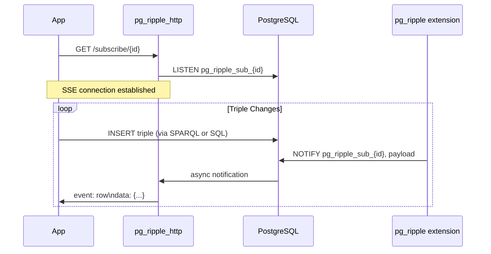

# CDC Subscriptions

> Added in v0.42.0

## Overview

**Change Data Capture (CDC) subscriptions** let your application subscribe to a real-time stream of RDF triple changes — filtered by SPARQL pattern or SHACL shape — without polling the database.

When a matching triple is inserted or deleted, pg_ripple sends a PostgreSQL `NOTIFY` message on a named channel. Listeners receive a JSON payload describing the change. The `pg_ripple_http` companion service exposes these subscriptions as Server-Sent Events (SSE) streams for web and streaming applications.




## Creating a Subscription

```sql
-- Subscribe to all triple changes.
SELECT pg_ripple.create_subscription('my_feed');

-- Subscribe with a SPARQL pattern filter.
SELECT pg_ripple.create_subscription(
    'person_changes',
    filter_sparql := 'SELECT ?s ?p ?o WHERE { ?s a <https://schema.org/Person> ; ?p ?o }'
);

-- Subscribe with a SHACL shape filter.
SELECT pg_ripple.create_subscription(
    'shape_violations',
    filter_shape := '<https://shapes.example.org/PersonShape>'
);
```

### Parameters

| Parameter | Type | Default | Description |
|---|---|---|---|
| `name` | `TEXT` | required | Unique subscription name (alphanumeric + `_`/`-`, max 63 chars) |
| `filter_sparql` | `TEXT` | `NULL` | Optional SPARQL SELECT pattern; only matching triples are published |
| `filter_shape` | `TEXT` | `NULL` | Optional SHACL shape IRI; only shape-violating triples are published |

Returns `TRUE` if created, `FALSE` if a subscription with that name already exists.

## Listening for Changes

```sql
-- Start listening.
LISTEN pg_ripple_cdc_my_feed;

-- Insert a triple.
SELECT pg_ripple.insert_triple(
    '<https://ex.org/alice>',
    '<https://schema.org/name>',
    '"Alice"'
);

-- In your application, receive notifications via pg_notify/asyncpg/etc.
```

### Notification Payload

Each notification carries a JSON payload:

```json
{
  "op": "add",
  "s": "<https://ex.org/alice>",
  "p": "<https://schema.org/name>",
  "o": "\"Alice\"",
  "g": ""
}
```

| Field | Value |
|---|---|
| `op` | `"add"` for INSERT, `"remove"` for DELETE |
| `s` | Subject — N-Triples formatted IRI or blank node |
| `p` | Predicate — N-Triples formatted IRI |
| `o` | Object — N-Triples formatted literal or IRI |
| `g` | Named graph IRI, or empty string for the default graph |

## Listing Subscriptions

```sql
SELECT name, filter_sparql IS NOT NULL AS has_filter, created_at
FROM pg_ripple.list_subscriptions()
ORDER BY created_at;
```

## Dropping a Subscription

```sql
-- Returns TRUE if removed, FALSE if not found.
SELECT pg_ripple.drop_subscription('my_feed');
```

## WebSocket Access via pg_ripple_http

When the `pg_ripple_http` companion service is running, subscriptions are accessible as WebSocket endpoints:

```
ws://<host>:8080/ws/subscriptions/{name}
```

The service supports content negotiation via the `Accept` header:
- `application/json` (default) — JSON payload
- `text/turtle` — Turtle-serialized change notification
- `application/ld+json` — JSON-LD change notification

## Integration Patterns

### GraphRAG Pipeline

```python
import asyncpg

async def watch_entity_changes():
    conn = await asyncpg.connect(dsn)
    await conn.execute("LISTEN pg_ripple_cdc_entity_changes")

    async for notification in conn.listen("pg_ripple_cdc_entity_changes"):
        payload = json.loads(notification.payload)
        # Re-embed entity on change.
        await update_embedding(payload["s"])
```

### Live Dashboard

```javascript
const ws = new WebSocket("ws://localhost:8080/ws/subscriptions/dashboard_feed");
ws.onmessage = (event) => {
  const change = JSON.parse(event.data);
  updateDashboard(change.op, change.s, change.p, change.o);
};
```

## Underlying Tables

| Table | Description |
|---|---|
| `_pg_ripple.subscriptions` | Named subscription registry |
| `_pg_ripple.cdc_subscriptions` | Low-level predicate-pattern subscriptions (v0.6.0 legacy API) |

## Related Functions

| Function | Description |
|---|---|
| `pg_ripple.create_subscription(name, filter_sparql, filter_shape)` | Create named subscription |
| `pg_ripple.drop_subscription(name)` | Remove named subscription |
| `pg_ripple.list_subscriptions()` | List all named subscriptions |
| `pg_ripple.subscribe(pattern, channel)` | Low-level subscription (v0.6.0 API) |
| `pg_ripple.unsubscribe(channel)` | Remove low-level subscription |

## Further reading

- [Blog: CDC and Knowledge Graphs](../../blog/cdc-knowledge-graphs.md) — real-time event streaming from your knowledge graph
