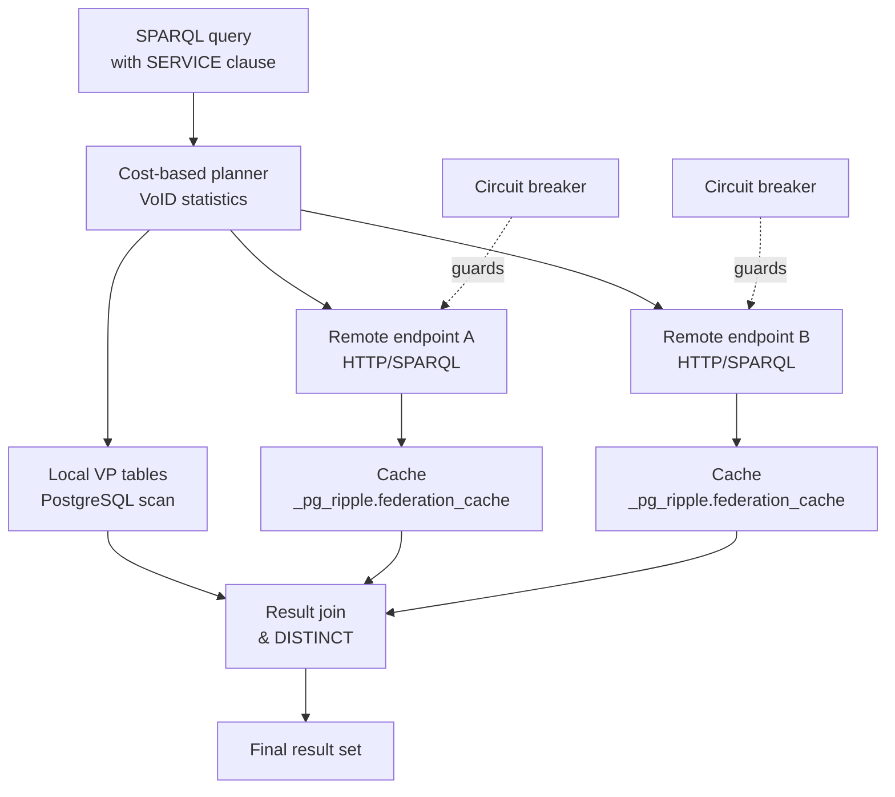

# Federation Reference

This page is the reference for pg_ripple's SPARQL 1.1 federation engine.

## Overview

pg_ripple implements SPARQL 1.1 Federated Query (SERVICE keyword) with a
cost-based planner, result caching, connection pooling, circuit-breaker
protection, and parallel remote execution. Local graphs can be mapped to
`SERVICE` endpoints so the planner transparently rewrites remote-looking queries
to local scans.




## Status

```sql
SELECT feature_name, status FROM pg_ripple.feature_status()
WHERE feature_name LIKE '%federation%' OR feature_name = 'sparql_federation';
```

## SQL Functions

| Function | Description |
|---|---|
| `pg_ripple.register_endpoint(url TEXT, name TEXT, complexity TEXT) → void` | Register a remote SPARQL endpoint |
| `pg_ripple.drop_endpoint(name TEXT) → void` | Remove an endpoint registration |
| `pg_ripple.list_endpoints() → SETOF record` | List all registered endpoints |
| `pg_ripple.is_endpoint_healthy(url TEXT) → BOOLEAN` | Check circuit-breaker health status |
| `pg_ripple.federation_stats() → SETOF record` | Per-endpoint query latency and error statistics |

## SERVICE Clause

Use the standard SPARQL `SERVICE` clause in queries:

```sparql
SELECT ?s ?label WHERE {
  ?s a <http://example.org/Person> .
  SERVICE <https://dbpedia.org/sparql> {
    ?s rdfs:label ?label .
    FILTER(LANG(?label) = "en")
  }
}
```

## Cost-Based Planning

The federation planner uses VoID statistics (stored in `_pg_ripple.endpoint_stats`)
to estimate remote result sizes and order SERVICE sub-queries to minimize
total network round-trips. The `complexity` field (`fast`/`normal`/`slow`)
adjusts ordering.

## Caching

Results from remote endpoints are cached in `_pg_ripple.federation_cache`
keyed by `(endpoint_id, query_hash)`. The cache TTL is controlled by
`pg_ripple.federation_cache_ttl` (default: 60 seconds).

## Circuit Breaker

Each endpoint tracks probe history in `_pg_ripple.federation_health`. When
an endpoint fails more than `pg_ripple.federation_circuit_threshold` times
within the probe window, it is marked unhealthy and future SERVICE calls
immediately return empty results until a successful probe.

## Shard Pruning (Citus)

When Citus is installed, SERVICE clauses that resolve to a local shard are
rewritten to direct shard scans, eliminating coordinator overhead. Multi-hop
pruning is supported for chained `SERVICE` patterns.

## Related Pages

- [Federation SQL Reference](../user-guide/sql-reference/federation.md)
- [HTTP API Reference](http-api.md)
- [Scalability](scalability.md)
- [Citus SERVICE Shard Pruning](citus-service-pruning.md)
- [Feature Status Taxonomy](feature-status-taxonomy.md)
