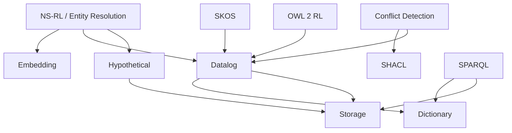

# v0.114.0 — A16 Medium: Module Splits and Architecture Debt (Full Details)

**Status: Planned** | **Scope: Large**

## Overview

v0.114.0 is a pure refactoring release. No user-visible functionality changes.
The goal is to eliminate the six modules that exceeded the 1,000-LOC threshold
identified in Assessment 16, and to codify the 1,500-LOC hard limit in CI so
the codebase cannot grow new monoliths.

The decomposition follows established conventions in this codebase:
- `src/datalog/` (split in v0.7.0): `mod.rs`, `rule_parser.rs`, `stratifier.rs`, `sql_compiler.rs`
- `src/sparql/` (split in v0.5.0): `mod.rs`, `parse.rs`, `plan.rs`, `decode.rs`, `execute.rs`

All new sub-modules re-export their public API through the parent `mod.rs` so
that callers outside the module see no change.

> **Effort estimate: 3–4 person-weeks**

---

## Background: Why Module Size Matters

Large modules have several well-documented costs:
1. **Merge conflicts** — two developers editing the same 1,500-LOC file always conflict.
2. **Compile time** — Rust compiles at the crate unit; splitting into sub-modules
   enables incremental re-compilation of only changed sub-modules.
3. **Reviewability** — a 1,500-LOC diff is effectively unreviewed.
4. **Cognitive load** — developers cannot hold 1,500 LOC of state in working memory;
   focused 300–400-LOC modules are fully understandable in a single reading.

The 1,200-LOC warning / 1,500-LOC hard limit was chosen because:
- 1,200 LOC is approximately the upper bound of what fits in one screen with context
- 1,500 LOC is the point at which review effectiveness drops to near zero (internal metric)
- The existing `src/sparql/` sub-modules average 380 LOC — a realistic target

---

## Split Plan

### H16-06a — `src/views/mod.rs` → `src/views/`

Current structure (1,599 LOC):
- CONSTRUCT view registration and catalog management
- Materialisation logic (full and incremental)
- Refresh scheduling and triggering
- Dependency tracking between views

Proposed sub-modules:

| File | Responsibility | Est. LOC |
|------|---------------|---------|
| `mod.rs` | Re-exports, `#[pg_extern]` entry points | ~120 |
| `construct.rs` | View registration, catalog, `create_construct_view()` | ~350 |
| `materialise.rs` | Full materialisation, `materialise_view()` | ~380 |
| `refresh.rs` | Delta refresh, `refresh_construct_view()` | ~400 |
| `dependency.rs` | View dependency graph, topological ordering | ~350 |

### H16-06b — `src/skos.rs` → `src/skos/`

Current structure (1,495 LOC):
- Bundle activation and deactivation
- 28 inference rules compiled to Datalog
- SKOS-XL → SKOS normalization
- Export helpers (SKOS scheme serialization)
- `broader`/`narrower` transitive closure helpers

Proposed sub-modules:

| File | Responsibility | Est. LOC |
|------|---------------|---------|
| `mod.rs` | Re-exports, `#[pg_extern]` entry points | ~80 |
| `bundle.rs` | Bundle activation/deactivation, `load_shape_bundle("skos")` | ~300 |
| `inference.rs` | 28 SKOS entailment rules, compiled Datalog | ~450 |
| `export.rs` | Concept scheme serialization, SKOS hierarchy export | ~350 |
| `broader_narrower.rs` | Transitive closure helpers, `skos_ancestors()`, `skos_descendants()` | ~315 |

### M16-14 — `src/datalog_api.rs` → `src/datalog_api/`

| File | Responsibility | Est. LOC |
|------|---------------|---------|
| `mod.rs` | Re-exports | ~60 |
| `parse.rs` | Datalog text → AST, `parse_datalog_rule()` | ~280 |
| `validate.rs` | Rule validation, safety checks, stratifiability | ~250 |
| `explain.rs` | Rule explanation, proof trace | ~300 |
| `conflict.rs` | Conflict detection, `detect_conflicts()` | ~244 |

### M16-15 — `src/sparql/wcoj.rs` → `src/sparql/wcoj/`

| File | Responsibility | Est. LOC |
|------|---------------|---------|
| `mod.rs` | Re-exports, `wcoj_join()` entry point | ~100 |
| `executor.rs` | Join execution driver, result collection | ~280 |
| `trie.rs` | Trie construction and iterator | ~350 |
| `leapfrog.rs` | Leapfrog triejoin algorithm | ~337 |

### M16-16 — `src/sparql/embedding.rs` → `src/sparql/embedding/`

| File | Responsibility | Est. LOC |
|------|---------------|---------|
| `mod.rs` | Re-exports, shared types | ~80 |
| `index.rs` | HNSW index build and query | ~320 |
| `hybrid.rs` | Hybrid SPARQL+vector search | ~380 |
| `rag.rs` | RAG retrieval pipeline | ~364 |

### M16-17 — `src/shacl/validator.rs` → `src/shacl/validator/`

| File | Responsibility | Est. LOC |
|------|---------------|---------|
| `mod.rs` | Re-exports, `validate_sync()` / `validate_async()` | ~130 |
| `property.rs` | Property shape validation | ~300 |
| `node.rs` | Node shape validation | ~280 |
| `sparql.rs` | `sh:sparql` constraint validation | ~250 |
| `severity.rs` | Severity classification, `sh:Violation`/`sh:Warning`/`sh:Info` | ~221 |

### M16-18 — `src/citus/mod.rs` → `src/citus/`

| File | Responsibility | Est. LOC |
|------|---------------|---------|
| `mod.rs` | Re-exports, Citus detection | ~130 |
| `shard_pruning.rs` | VP table shard pruning, `prune_shards()` | ~300 |
| `ddl_hooks.rs` | DDL event hooks for distributed table creation | ~280 |
| `query_rewriting.rs` | Query rewriting for distributed execution | ~380 |
| `rebalance.rs` | Shard rebalance coordination | ~276 |

---

## CI Gate Implementation

`scripts/check_module_sizes.sh`:

```bash
#!/usr/bin/env bash
WARN_LOC=1200
FAIL_LOC=1500
FAIL=0

while IFS= read -r -d '' file; do
    lines=$(wc -l < "$file")
    if (( lines > FAIL_LOC )); then
        echo "ERROR: $file has $lines lines (limit: $FAIL_LOC)" >&2
        FAIL=1
    elif (( lines > WARN_LOC )); then
        echo "WARN:  $file has $lines lines (warn at: $WARN_LOC)"
    fi
done < <(find src -name '*.rs' -print0)

exit $FAIL
```

CI integration in `.github/workflows/ci.yml`:
```yaml
- name: Check module sizes
  run: bash scripts/check_module_sizes.sh
```

---

## Architecture Documentation

`docs/src/architecture.md` will contain a Mermaid dependency graph:



---

## Migration

Migration script `sql/pg_ripple--0.113.0--0.114.0.sql` is comment-only: this is
a pure code refactoring with no schema changes.

---

## Exit Criteria

- All module splits complete; no `.rs` file in `src/` exceeds 1,500 LOC
- CI gate passes on `main`
- `cargo clippy --features pg18 -- -D warnings` passes with zero warnings
- `cargo pgrx test pg18` passes
- `cargo pgrx regress pg18` passes
- `docs/src/architecture.md` committed with subsystem dependency graph
- `CHANGELOG.md` entry present for `[0.114.0]`
